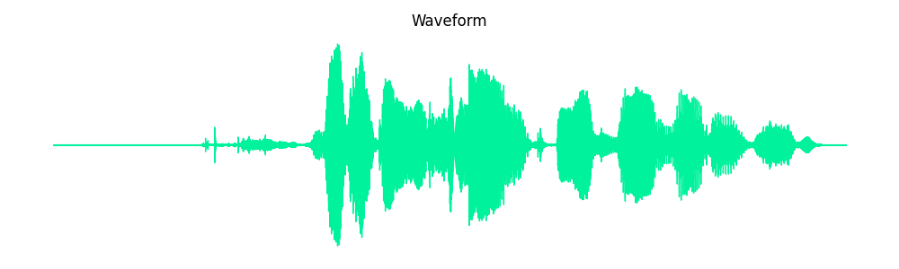

# 🎤 Speech Emotion Recognition Flask App

This web app recognizes human emotions (e.g., Happy, Sad, Angry) from uploaded audio using deep learning. It features a beautiful animated UI, waveform visualization, voice feedback, and supports both `.wav` and `.mp3`.

---

## 🚀 Features

* 🌟 Predicts 7 emotions: `angry`, `boredom`, `disgust`, `fear`, `happy`, `neutral`, `sad`
* 🎧 Supports `.wav` and `.mp3` audio files
* 📊 Visualizes waveform of the voice
* 🧠 Trained **Bidirectional LSTM** model
* 🔈 Speaks out prediction: “You are sad now”
* 🌈 Fully animated neon UI (responsive)
* 🔐 Uploads are temporary & private

---

## 🎮 Demo



> ✨ The waveform is generated automatically from the uploaded voice.

---

## 🧠 Model Architecture

The model is a **Bidirectional LSTM** with MFCC + delta features as input.

```plaintext
Input Layer: (160, 60)    ← MFCC + delta + delta²
↓
Bidirectional LSTM (128 units)
↓
Dropout (0.3)
↓
Dense (64) + ReLU
↓
Dense (7) + Softmax
↓
Output: Emotion Class
```

> Trained using EMO-DB (Berlin Database of Emotional Speech)

---

## 📂 Dataset

We used the [EMO-DB Dataset (Berlin Emotional Speech Corpus)](https://www.kaggle.com/datasets/johnnyko28/emodb-emotional-berlin-database) with 7 emotional labels.

Other recommended datasets:

* [RAVDESS](https://www.kaggle.com/datasets/uwrfkaggler/ravdess-emotional-speech-audio)
* [TESS](https://www.kaggle.com/datasets/chekagust/tess)

---

## 📁 Project Structure

```
emotion_app/
├── app.py
├── model/
│   └── emotion_bilstm_final_model.keras
├── static/
│   └── waveform.png         ← Auto-generated
├── templates/
│   └── index.html           ← Animated UI
├── uploads/
│   └── (Temporary audio)
└── README.md
```

---

## 📦 Installation

1. **Install dependencies**

```bash
pip install flask librosa tensorflow matplotlib pyttsx3 ffmpeg-python
```

2. **Install FFmpeg** (for mp3 support):

* Windows: [https://ffmpeg.org/download.html](https://ffmpeg.org/download.html)

---

## 🔧 Run the App

1. Clone the repo:

```bash
git clone https://github.com/yourusername/emotion-recognition-app.git
cd emotion-recognition-app
```

2. Put your trained model in `model/emotion_bilstm_final_model.keras`

3. Run the app:

```bash
python app.py
```

4. Open in browser:
   [http://127.0.0.1:5000](http://127.0.0.1:5000)

---

## 🧰 How It Works

1. Upload an audio file (`.wav` or `.mp3`)
2. Features (MFCCs + delta + delta²) are extracted
3. Bidirectional LSTM predicts emotion
4. Result is spoken out
5. Waveform is plotted and displayed

---

## 📌 Roadmap / Future Add-ons

* 🎧 Real-time mic input recording
* 📊 Probability bar chart
* 🐽 Emoji / avatars based on mood
* 🧹 Hugging Face or Render deployment
* 📃 Upload history or emotion log
* 🎿 Voice pitch analysis

---

## 📷 Screenshots

| Upload Form                  | Result + Waveform        |
| ---------------------------- | ------------------------ |
|  |  |

---

## ☁ Deployment Ideas

### 🌐 Host on Hugging Face Spaces

* Easy with Gradio UI version

### 🌍 Use Render.com

* Add `requirements.txt` and `Procfile`

---

## 👨‍💼 Author

**Zain ul Abdeen**
BS in Artificial Intelligence
🚀 Passionate about AI, Deep Learning & Real-World Applications
📧 [LinkedIn](#) | [Portfolio](#) | [Email](#)

---

## 📜 License

This project is licensed under the [MIT License](LICENSE)

---

## ⭐ Show Your Support

If you like this project, consider giving it a ⭐ on GitHub!
